# 🍰 CakeBake

> A full-stack online bakery store built with ASP.NET Core MVC.

CakeBake is a web-based bakery e-commerce application that allows customers to browse bakery products, manage their shopping cart, place orders, and manage their profiles.

The project also includes an admin dashboard for managing products, categories, orders, customers, and store-related content.

---

## ✨ Features

### 👩‍💻 Customer Features

- User Registration & Login
- Email verification and OTP-based password reset
- Browse bakery products
- Search and filter products
- View product details
- Add products to cart
- Update cart quantities
- Checkout and place orders
- View order history
- View order details
- Manage personal profile
- Contact the store

### 🔐 Admin Features

- Admin authentication
- Admin dashboard
- Product management
- Category management
- Order management
- Customer management
- Admin profile management
- Contact message management
- Store settings management

---

## 🛠️ Technologies Used

### Backend

- C#
- ASP.NET Core MVC
- Entity Framework Core
- ASP.NET Core Identity
- LINQ

### Database

- SQL Server
- Entity Framework Core Migrations

### Frontend

- HTML5
- CSS3
- JavaScript
- Bootstrap
- jQuery
- Razor Views

### Services & Tools

- Cloudinary for image management
- Email service for verification and password reset
- Visual Studio
- Git & GitHub

---

## 🏗️ Project Architecture

The project follows a structured MVC architecture with a service layer.

```text
CakeBake
│
├── Configurations
├── Constants
├── Controllers
├── Data
├── Enums
├── Interfaces
├── Migrations
├── Models
├── Seed
├── Services
├── ViewModels
├── Views
└── wwwroot
```

### Main Layers

#### Controllers

- Handle HTTP requests
- Manage application flow
- Communicate with services

#### Services

- Contain business logic
- Handle database operations
- Keep controllers clean and maintainable

#### Models

- Represent application entities and database tables

#### ViewModels

- Transfer the required data between controllers and views
- Provide the data required by each specific view

#### Views

- Razor-based UI pages for customers and administrators

---

## 📸 Screenshots

### Home Page

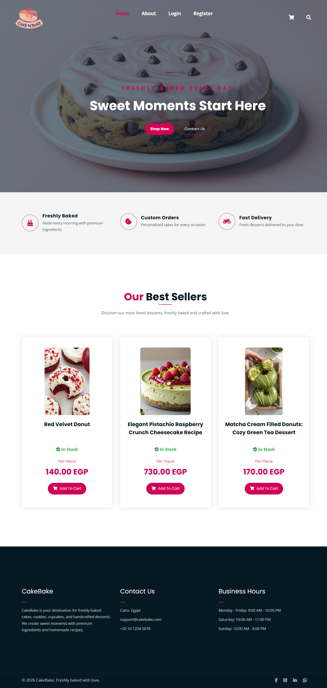

### Shop

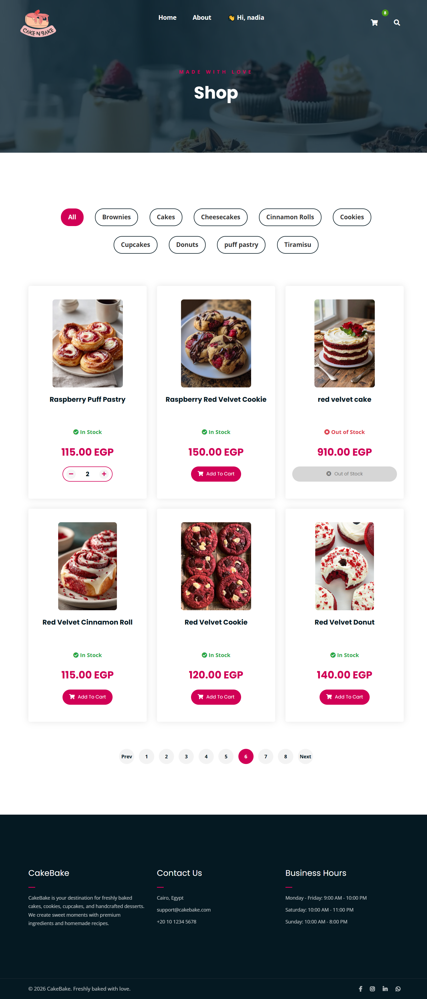

### Product Details

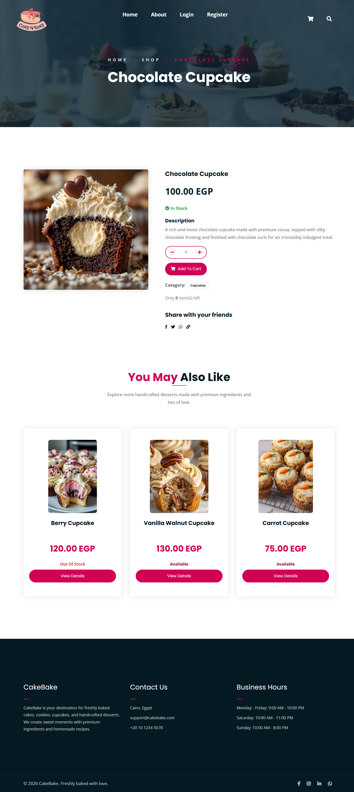

### Shopping Cart

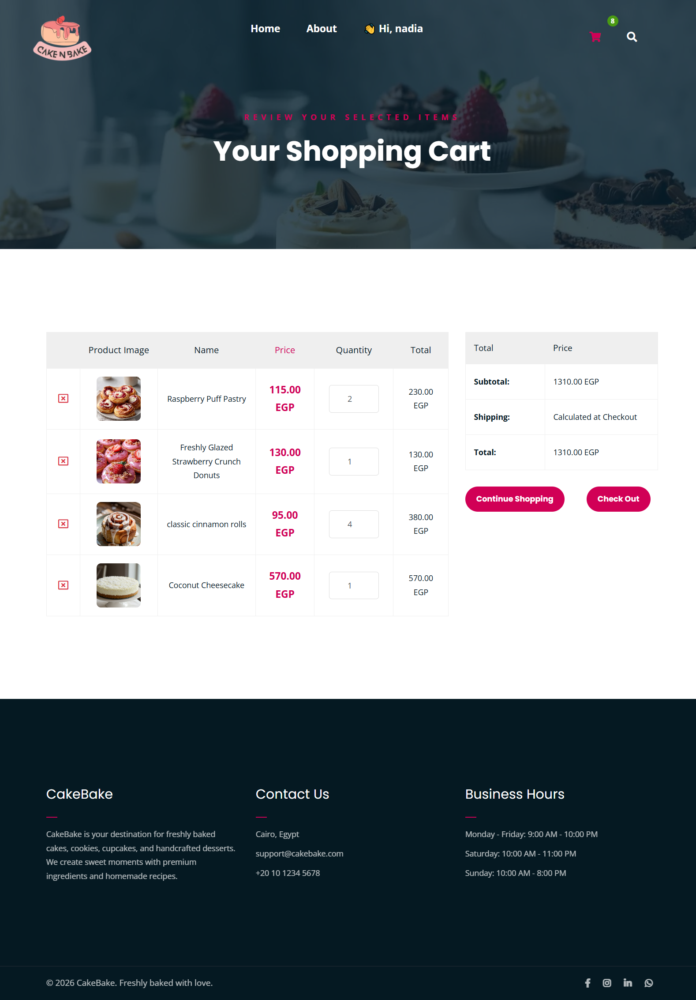

### Checkout

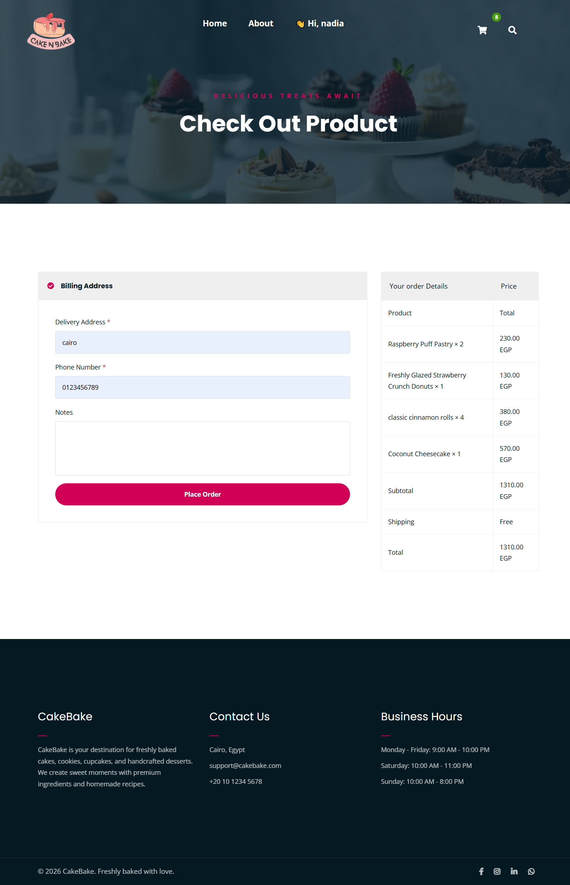

### Admin Dashboard

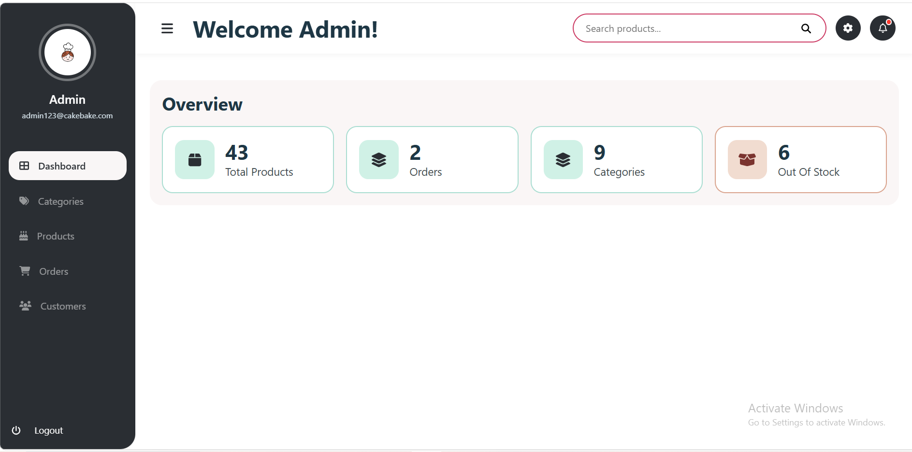

### Product Management

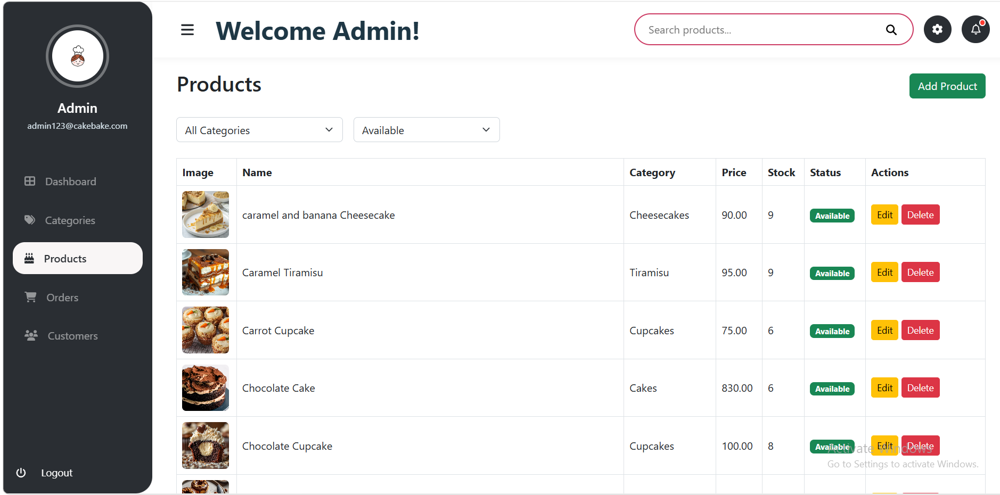

### Categories

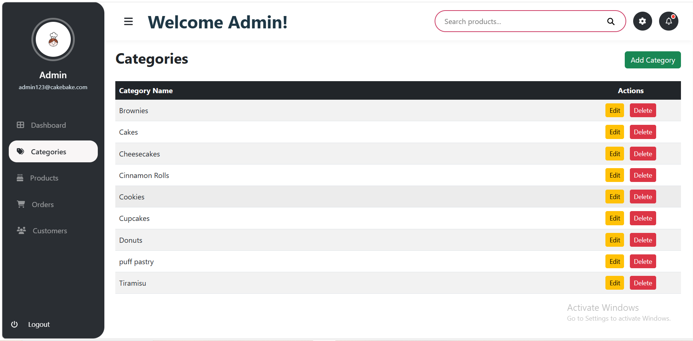

### Orders

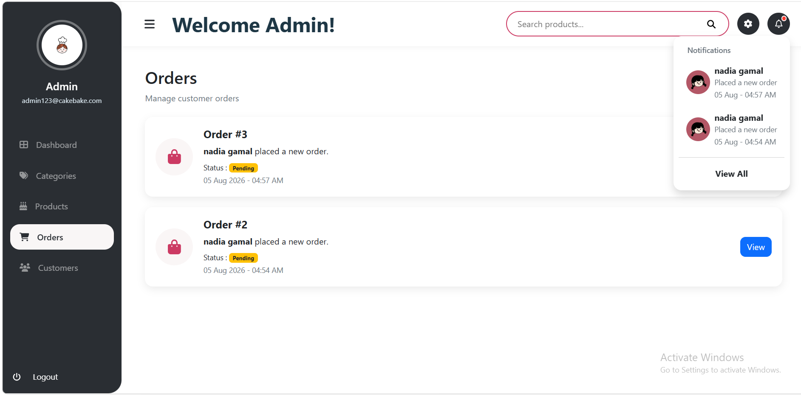

### My Orders

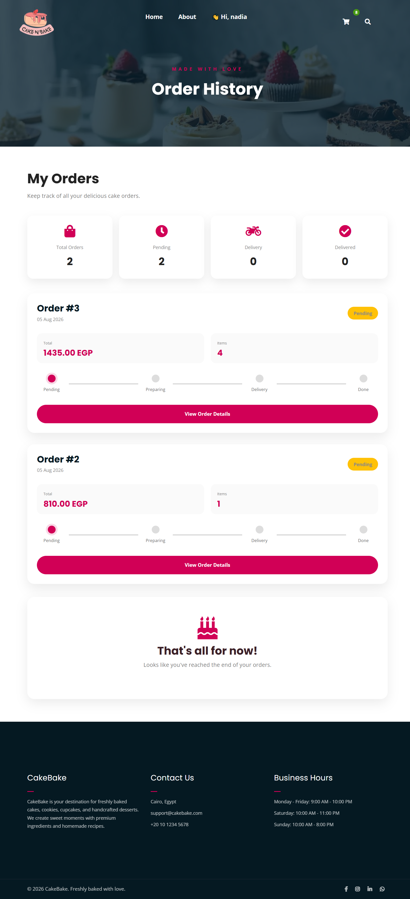

### Customer Profile

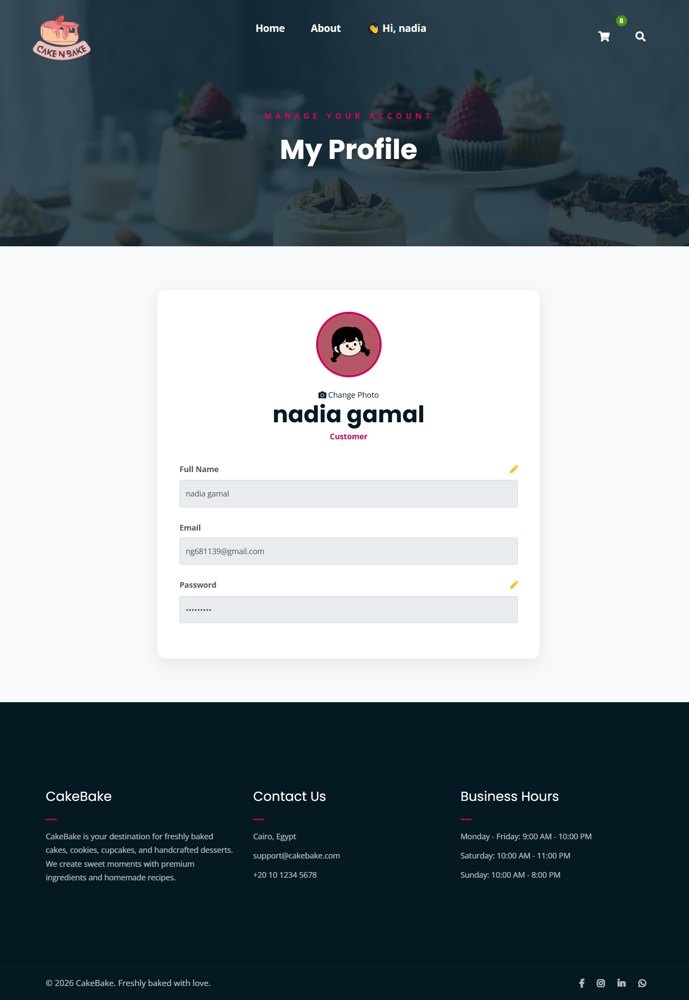

### Admin Profile

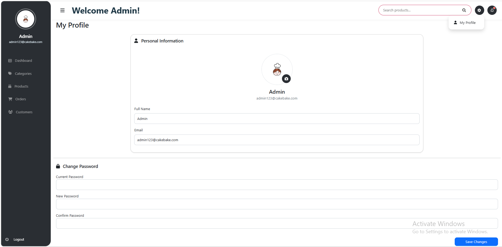

### Customers

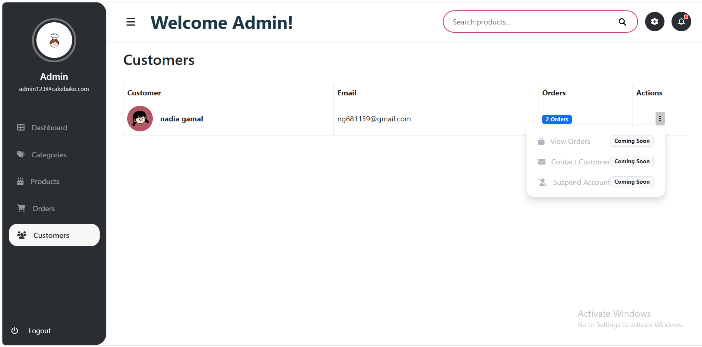

### Login

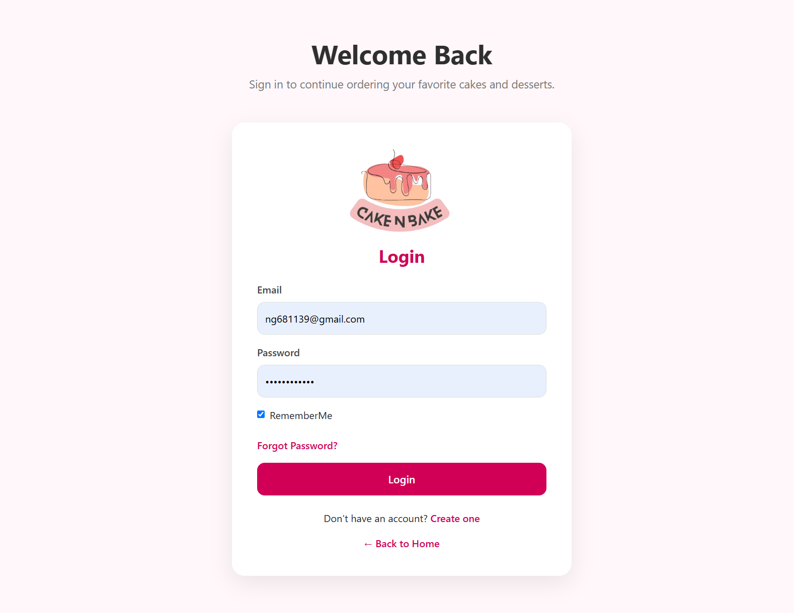

### Register

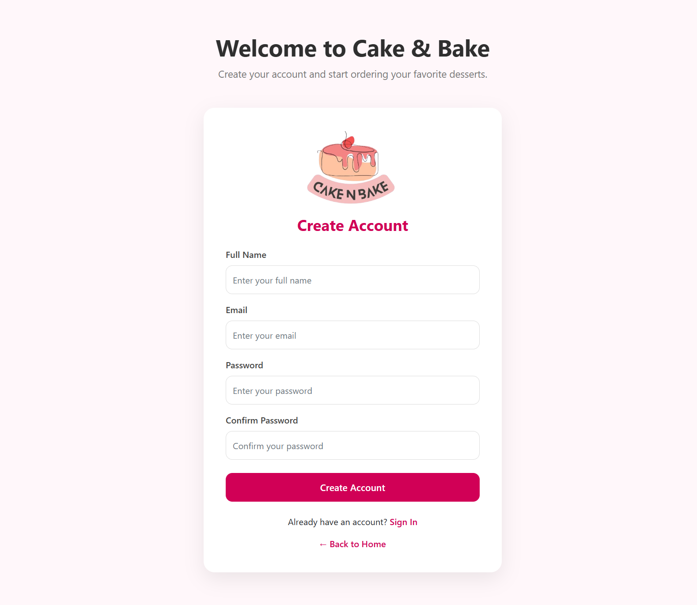

### About

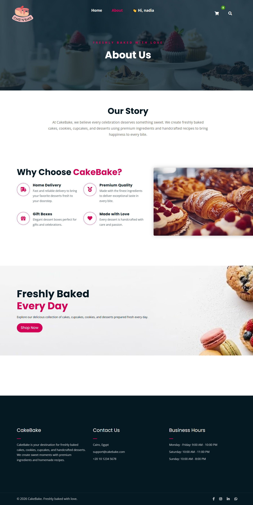

### Contact

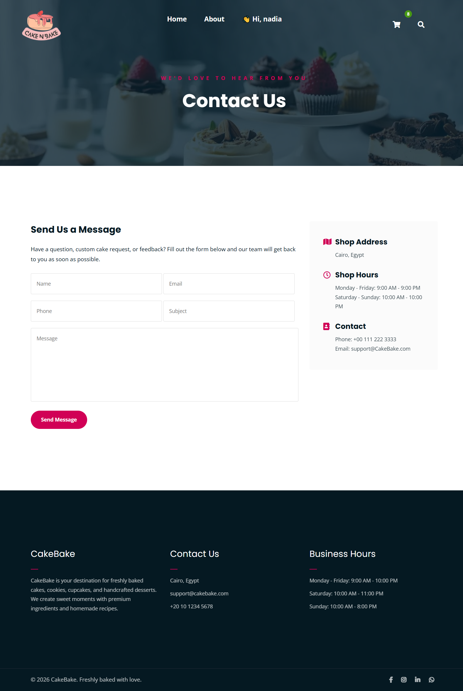

---

## 🚀 Getting Started

### Prerequisites

- .NET SDK
- SQL Server
- Visual Studio 2022

### Setup

1. Clone the repository.

2. Open the solution in Visual Studio.

3. Configure the database connection string in `appsettings.json`.

4. Apply the Entity Framework Core migrations.

5. Build and run the application.

---

## 👩‍💻 Author

**Nadia Gamal**

GitHub: [nadia-gamal](https://github.com/nadia-gamal)